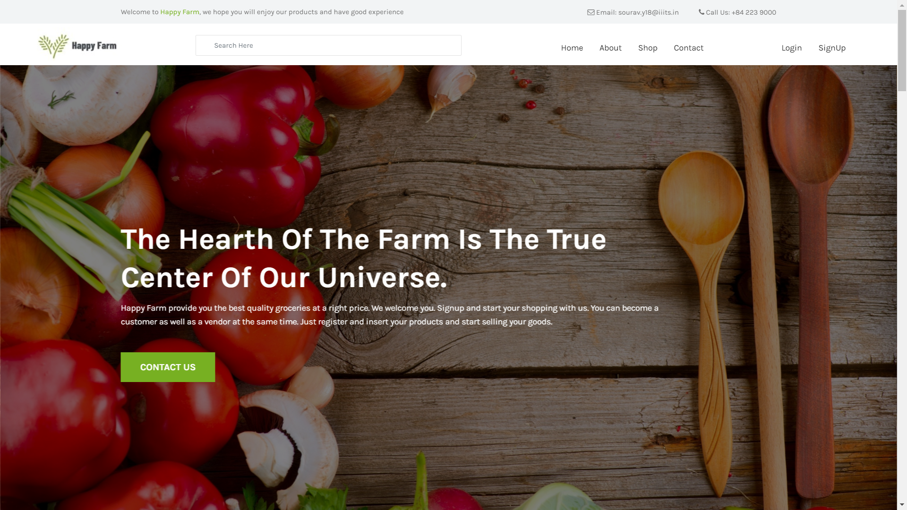
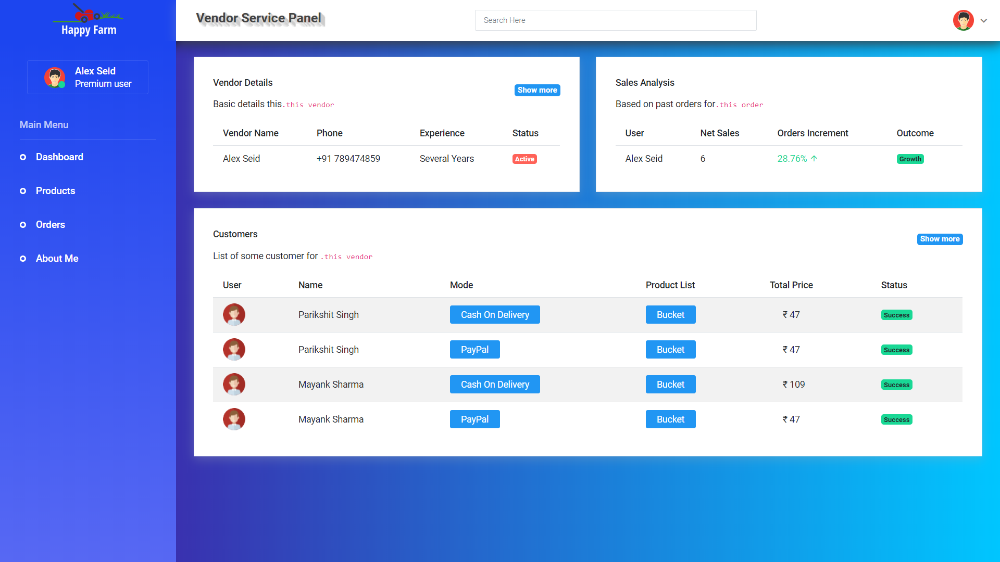
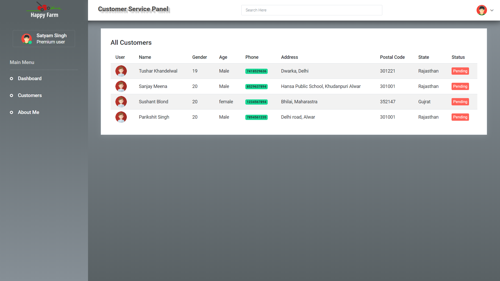

# A Go Thru Of The WebApp
Happy farm is an online platform deal with less literate farmers around the globe.
The Application is divided into **Three** different category. We also call them Apps in Django.

_**User App**_  
_**Vendor Services**_  
_**Customer Service Support**_

1. **User App** -  

_Description_ - The User app is normal as an ecommerce application where you can buy stuff online. It got different features. Like Shopping cart, Checkout, Orders Details. The payment gateway Paypal is also included. 
_For less literate_ people we have this feature of people adding their phone number and email address form submission. A text message from twilio API would be send and Email would be send to the user about the company. After than a customer care support will call them so as to clear their doubts.

2. **Vendor Services** -  

_Description_ - The vendor service panel is at the url localhost:8080/vendor. Here we have a dashboard for vendor to manage their inventory and stock. They can add new products, details about them and delete them as well. Another interesting feature we have is whenever an order is placed from the _user App_ . Vendor has a customer list where it will be shown.

3. **Customer Service Support** -   

_Description_ - The customer support also maintains a dashboard where whenever a user asks for help. They submit their number on the user app and that number will all the other details about the customer will be shown here. What the customer support panel has to do is to make a call and clear all of their doubts. As soon as the customer is satisfied the service people toggles the status to complete and close the case.

# Web Application on the following Tech-Stack:
Django, PostGreSQL, HTML, CSS, JS, Bootstrap, JQuery.
API's include Twilio, Gmail, Paypal.

# Pre-requisite - 
* Django. https://docs.djangoproject.com/en/3.0/topics/install/ .
* PostgreSQL. https://www.postgresql.org/download/
* To operate on API's create developer's account for all of them.
* Twilio - https://www.twilio.com/try-twilio
* Paypal - https://www.paypal.com/signin/client?flow=provisionUser&country.x=US&locale.x=en_US
* Gmail - https://console.developers.google.com/

# Pre-running setup-
1. Before running the server make sure your database (PostgreSQL) is connected to your django application.
While installing postgreSQL software you might have set your username and password. Copy paste them in the project/settings.py file.    
-> DATABASES = {  
    'default': {  
        'ENGINE': 'django.db.backends.postgresql',  
        'NAME': 'databasename',  
        'USER' : 'username',  
        'PASSWORD' : 'password',  
        'HOST' :'localhost'  
      }  
  }  
  
2.  Creating database tables, migrating models.
    Run the following command.  
    -> python manage.py makemigrations  
    -> python manage.py migrate  
    To cross check the successfull migrations go to your database GUI and check for tables. You'll see new tables popping up.
   
3. Serve Static Files.
    In project/settings.py make sure you have the code as follows.  
    ->STATIC_URL = '/static/'  
      STATICFILES_DIRS = [  
          os.path.join(BASE_DIR, 'static')  
      ]  
      STATIC_ROOT = os.path.join(BASE_DIR, 'assets')  
     Now run the command-  
     ->python manage.py collectstatic
     
 # Running the Server
 Now that we are all set up with the project it's time to run it.
 -> python manage.py runserve
 Go to your browser and type localhost:8080
 Here comes your Happy Farm's Webapp
